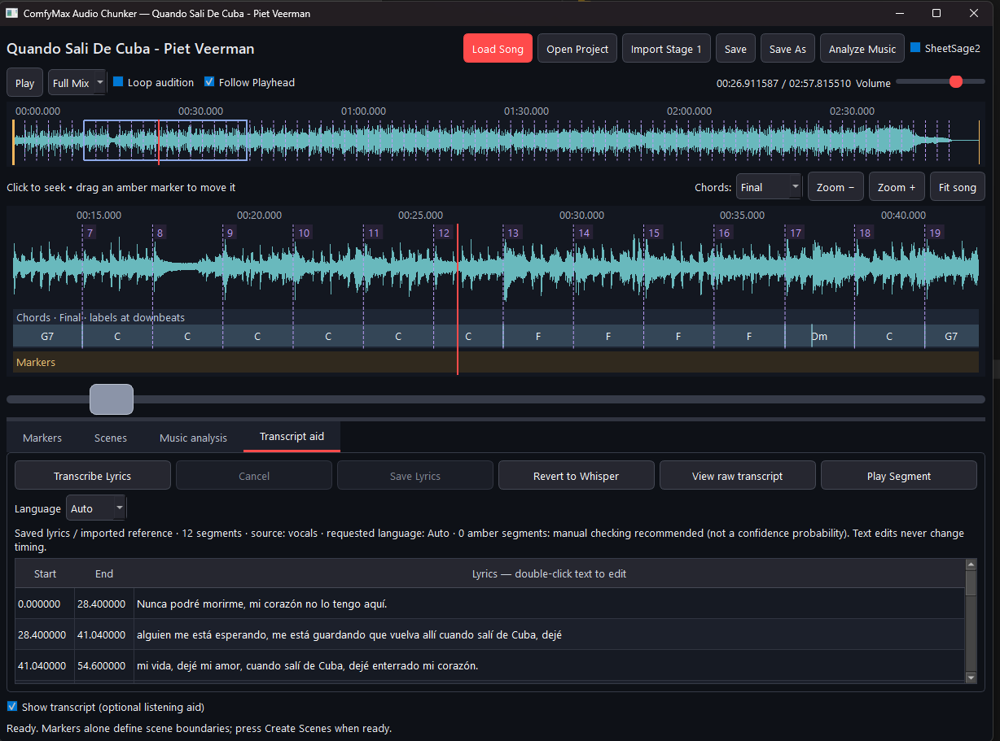

# ComfyMax MusicLab



**ComfyMax MusicLab** is a local music-analysis and scene-preparation workspace built around a waveform editor. It combines manual markers and scene creation with optional music analysis, chord/downbeat visualization, editable Whisper lyrics, and SheetSage2 symbolic transcription. Processing stays local; the application is designed to work without cloud credits.

The marker workflow remains **Load Song → local Demucs separation → edit markers → Create Scenes → Export Scenes**. Markers define scene boundaries. Each interval has an editable Vocal/Instrumental Type, initially suggested from the available vocal stem; manual choices persist and are copied into scenes when Create Scenes is selected.

Music Analysis is an additional layer and does not take control of manual scene boundaries. Current analysis features include rhythm/downbeat information, chord analysis and visualization, Transcript Aid with editable lyrics, and optional SheetSage2 ABC/event transcription. SheetSage2 is installed separately with the included `Install_SheetSage.bat` because its model/runtime are too large to store in Git.

Double-click `Launch Editor.cmd` to start the application. Existing projects open directly. MusicLab uses a dedicated Python 3.11 environment, separate from ComfyUI; a packaged executable is not yet provided.

## Install on Windows 10 (64-bit)

Prerequisites: FFmpeg and ffprobe on PATH; either Python **3.11** with the `py` launcher, or `uv` available on PATH. Python 3.14 is not used. If you do not have uv, install Python 3.11 from https://www.python.org/downloads/release/python-3119/ (Windows installer, 64-bit) and rerun setup. No administrator shell is required.

```powershell
Set-Location D:\ComfyMax-MusicLab
powershell -NoProfile -ExecutionPolicy Bypass -File .\setup.ps1
```

The execution-policy override applies to that process only. Setup creates `.venv`, installs pinned primary dependencies, checks dependency consistency, and runs the unit tests. With uv, it downloads a private Python 3.11 under `.python`; otherwise it uses `py -3.11` to create the dedicated environment. It never uses or installs into ComfyUI's Python. The CUDA 12.8 PyTorch build supports the RTX 5060 Ti generation. Downloads are several GB; allow disk space for Python, packages, package cache, models and audio copies.

For a smaller CPU-only installation on a different machine:

```powershell
powershell -NoProfile -ExecutionPolicy Bypass -File .\setup.ps1 -CpuOnly
```

Choose this at initial setup; changing an existing environment's CPU/CUDA flavor is not covered by the prototype installer. `installed-versions.txt` records the resolved dependency versions. Direct dependencies are pinned; this is not yet a distribution-grade fully locked installer.

## Analyse a real song

```powershell
Set-Location D:\ComfyMax-MusicLab
powershell -NoProfile -ExecutionPolicy Bypass -File .\analyze.ps1 -Song "D:\Music\my song.wav" -Language en
```

WAV, FLAC, MP3 and other formats FFmpeg can decode are accepted. Omit `-Language en` for language detection, or use the correct language code. The first audio stream is used. The original is opened only for reading and verified by SHA-256 before and after the run. Do not edit the source file in another application while analysis runs.

By default, output goes to a new timestamped directory under `runs`. For a named output directory:

```powershell
.\analyze.ps1 -Song "D:\Music\my song.flac" -Output "D:\ComfyMax-MusicLab\runs\song-test-01" -Device cpu
```

The output folder **must not already exist**. Reruns need a new folder; the app refuses to overwrite an earlier run. If script policy blocks this command, use the `powershell -NoProfile -ExecutionPolicy Bypass -File` form above.

Demucs defaults to `auto`: CUDA when available with more than 4 GiB free at the start, otherwise CPU. This is a heuristic, not a VRAM reservation. Close or unload GPU work yourself if you want faster GPU analysis. Explicit `-Device cuda` selects GPU, `-Device cpu` avoids it. A GPU out-of-memory failure is reported; rerun with CPU and a new output folder. The prototype never stops ComfyUI or other applications.

Whisper uses CPU int8 by design, avoiding a separate CUDA/cuDNN setup for CTranslate2. The default multilingual `small` model is a practical first test. Try `-Model medium` or `-Model large-v3` for harder songs, with higher RAM use and runtime. Model quality and lyric accuracy must be judged on your songs.

First use downloads Demucs and Whisper weights; audio is never sent to a cloud service. Model files live in the project's `.cache`. After a successful download, use `-Offline` to require cached models. A local faster-whisper model directory can also be passed to `-Model`. Dependency installation still needs internet.

## Output files

| File | Purpose |
| --- | --- |
| `analysis.txt` | Readable region, phrase, segment and word timestamps; suspect words marked `?` |
| `analysis.json` | Structured Stage 1 analysis, source hash, source format, settings, versions and diagnostics |
| `vocals.wav` | Demucs vocal stem for listening and transcription only, 44.1 kHz stereo float WAV |
| `analysis_mix.wav` | Full decoded 44.1 kHz stereo analysis copy, never a replacement for the original |
| `analysis.log` | Progress and errors |
| `failure.json` | Only on failed processing, explains failure and source hash check |

Times in JSON are floating-point **seconds from the first decoded audio sample**, with unrounded region bounds. Regions cover the whole decoded timeline without gaps/overlap, including instrumental intro, interludes, outro and silence. `kind` is `vocal` or `instrumental`; every region is explicitly estimated and requires review. Analysis is resampled for Demucs; the original file remains untouched. Scene export uses the already decoded, aligned Stage 1 proxies and approved integer sample boundaries. Whisper estimates are not sample-accurate vocal alignments.

`words` contains word start/end times, model probabilities and suspect flags. `segments` retains Whisper's output and confidence diagnostics. `phrases` groups non-suspect words at pauses (0.65 s) and punctuation; these are candidate phrase spans, not sentence guarantees or approved cut points. `energy_vocal_intervals` preserves the acoustic detector evidence. Nothing enforces 5–15 second chunks in Stage 1.

## How detection works and where review is necessary

1. FFmpeg decodes a separate analysis copy with no trimming or silence removal.
2. Demucs `htdemucs` isolates vocals. All-channel normalization handles stereo signals whose channels cancel when summed; output uses float WAV without clipping normalization.
3. Vocal-stem energy in 50 ms frames is compared to its peak, an absolute floor and mix energy. Short gaps are bridged and boundaries padded. This can capture wordless vocals even when Whisper recognizes nothing.
4. faster-whisper transcribes the complete stem with word timestamps. Speech VAD is disabled because it can miss singing. Previous-text conditioning is disabled to reduce repetition. Low-confidence or acoustically unsupported words remain visible but are excluded from phrase grouping.
5. Supported words and stem activity form estimated vocal regions; the complement is estimated instrumental activity.

There is no perfect automatic vocal classifier here. Instrument bleed can look like vocals, breathy singing can be missed, reverb can extend boundaries, and Whisper can hallucinate lyrics or infer misleading punctuation. Suspect flags are heuristics, not calibrated probabilities. This stage must pass real-song listening review before building the editor.

Advanced threshold tuning is available directly:

```powershell
.\.venv\Scripts\python.exe -m comfymax_audio_chunker "D:\Music\my song.wav" --floor-db -52 --relative-db -35 --ratio-db -26
```

More negative values make detection more sensitive, including more bleed; less negative values are stricter. Compare against the saved stem and mix rather than assuming a universal preset.

## Tests and approval gate

```powershell
.\.venv\Scripts\python.exe -m unittest discover -s tests -v
.\.venv\Scripts\python.exe -m pip check
```

Unit tests cover silence, anti-phase stereo, intro/outro preservation, exact region coverage, short tails and phrase grouping. They do not establish model quality on music.
They also cover combining stem intervals with recognized words, JSON serialization, and high speech-oriented no-speech scores on acoustically supported singing. That score remains diagnostic but does not by itself reject a sung segment.

For an actual model smoke test using a generated instrumental signal (downloads weights on first use):

```powershell
.\.venv\Scripts\python.exe tests\smoke_models.py
```

See `TEST_RESULTS.md` for the checks already completed on this machine and the remaining real-song test.

For the real-song acceptance test:

- Confirm `source.unchanged` is true in JSON.
- Listen to `vocals.wav`: confirm lead/backing vocals survive separation and inspect bleed.
- Compare transcript words and timestamps with the song, particularly sustained notes and repeated choruses.
- Listen around every vocal/instrumental transition; record missed vocals and false vocal regions.
- Confirm intro/outro and wordless sections are represented, and all durations match the decoded song.
- Record the song, settings, problems and whether Stage 1 is acceptable. Do not begin Stage 2 until the user approves.

Failures retain partial files for diagnosis. Interrupted runs do not resume; start a new output folder. A failed run without `analysis.json` is not a completed analysis. Runtime and memory scale with song length; the prototype loads full decoded audio and is intended for songs, not multi-hour recordings.

## Upstream references

- Demucs: https://github.com/facebookresearch/demucs (archived upstream; version 4.0.1 pinned for this prototype)
- faster-whisper: https://github.com/SYSTRAN/faster-whisper
- PyTorch installation/builds: https://pytorch.org/get-started/locally/

Model/package licenses should be reviewed before redistribution. Review the component licenses before redistribution, especially the non-commercial SheetSage2 model license described below.

## Install optional SheetSage2

1. Unzip/clone this repository into a writable folder. Install the Windows/Python/FFmpeg
   prerequisites above and run `setup.ps1` from that folder.
2. Optional: double-click **Install_SheetSage.bat**. It installs the required audio.cpp runtime and SheetSage2 model inside
   ComfyMax MusicLab, verifies downloads, and reuses an already valid installation. No separate
   Audio.cpp installation or manual model-path configuration is needed.
3. Allow about **3.55 GB downloads / 10 GB free installation space**. The SheetSage2 weights are
   **CC BY-NC 4.0: non-commercial use only**. This tester path uses CUDA and requires a compatible
   NVIDIA driver (validated on RTX 5060 Ti). See [component requirements and licenses](engines/sheetsage/README.md).
4. Double-click **Launch Editor.cmd**. Open/import a song; in Music Analysis verify
   **SheetSage2: Ready**, enable the optional SheetSage2 checkbox and click **Analyze Music**.
   Saved ABC/events remain available even without the runtime installed.
5. Without SheetSage, the editor and normal Music Analysis still work. Fresh installs use the
   existing librosa/template defaults; optional Beat-Transformer/CNN developer configurations
   are not bundled by this SheetSage installer. Saved neural evidence remains readable.
6. Report issues at [GitHub Issues](https://github.com/ComfyMaxAI/ComfyMax-MusicLab/issues).
   Include Windows/GPU/driver details, the installer error or SheetSage runtime logs and steps
   to reproduce. Review logs for private local paths before sharing; do not upload private audio.

No model, downloaded runtime, user audio, project or cache should be committed. This is a
source-plus-installer tester distribution, not a prebuilt application or a commercial model license.


## SheetSage2 MIDI export

In **Music Analysis**, use **Export MIDI...** after a successful saved SheetSage2
transcription. Choose the destination; replacing an existing MIDI requires confirmation.
The exporter uses preserved native note events (or existing normalized notes), never
parses `score.abc` and never reruns analysis. Original evidence and other analyses stay
unchanged. Standard MIDI File Type 1, 960 PPQ exports can be opened and edited in DAWs
such as Studio One, REAPER, Cubase, Ableton Live and FL Studio. Compatibility is based
on the standard format; see the Phase 2E report for applications actually tested.

Run `setup.ps1` to install the pinned small `mido==1.3.3` editor dependency. Without it
the application still opens, but MIDI export is disabled. Projects without suitable
SheetSage evidence or a reliable stored global tempo also have export disabled.

Timing uses the preserved SheetSage global tempo and absolute note seconds, with no
Beat-Transformer/CNN alignment or quantization to the MusicLab grid. No tempo changes
are inferred. Timed native meter/key tokens are decoded only for the verified audio.cpp
0.8.1/model identity; other versions use reliable initial stored declarations. Additional
ABC-only changes stay in the source evidence because their times are unproven.
Verified tracks are named Vocal Melody / Instrumental Melody; unknown versions use
SheetSage Track N. Velocity is fixed at 80; no instruments or dynamics are invented.
Separate melodic channels avoid channel 10. Same-pitch overlaps use extra channels;
exceeding the 15-channel limit fails explicitly instead of losing notes.

Every export is read back and checked before publication. The project stores the latest
export provenance, source hash, diagnostics and timing errors, without requiring the
external MIDI file to remain present. Invalid notes are explicitly reported; positive
notes shorter than one tick can be extended to one tick with a diagnostic. Duration is
the final note end, which may differ from the full audio duration. Model transcription
can contain errors and may need manual correction in a DAW.
# Score Viewer (Phase 2F)

The editor offers **Timeline | Score | ABC** views with the existing audio controls
above them. Open a saved SheetSage analysis and choose **Score**; **ABC** shows its
original, read-only `score.abc`. Viewing never reruns SheetSage and does not require
its inference runtime or model. Projects without a score show a friendly empty state.

The score currently represents the **SheetSage2 ABC transcription**, including its
voices/melodies, chord symbols, tempo, rests and encoded key/meter changes. This is
model-generated transcription: do not assume every note or chord is correct.
It does not use MIDI or substitute MusicLab's other chord/rhythm estimates.

Rendering is fully local/offline using bundled **abc2svg 1.22.1 (LGPL-3.0-or-later)** and the Qt
WebEngine component included in the existing PySide6 editor dependency. No CDN,
cloud service, Node installation or inference download is needed. Missing renderer
components affect only Score; Timeline and read-only ABC remain available.

Use **Zoom − / 100% / Zoom + / Fit Width** and vertical scrolling. Zoom changes
vector display size, not music data. **Export SVG…** saves the complete rendered
vector score outside the project folder. **Export PDF** saves the complete score as
vector PDF on A4 portrait pages with 15 mm margins and a white background, independent
of viewer zoom/scroll. Direct printer support and score/audio synchronization are not
included. Section comments remain inspectable
in ABC; they are not assigned invented score positions.

Renderer license and pinned package provenance are in
`src/comfymax_audio_chunker/editor/score_assets/`. The in-memory render cache is
bounded and keyed by ABC content, renderer version and layout options; no derived
score cache is written into the project.
