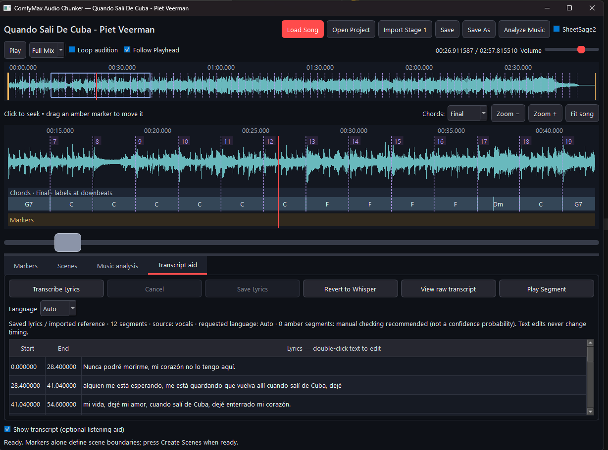
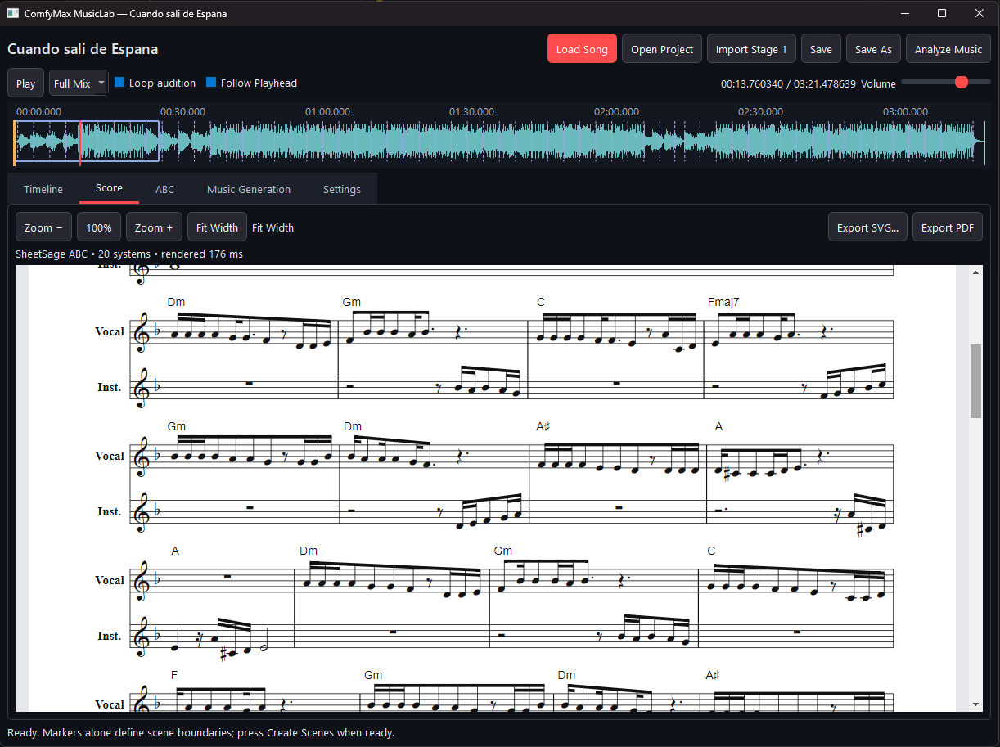

# ComfyMax MusicLab

ComfyMax MusicLab is a local Windows desktop application for music analysis, transcription, lyrics editing, chord and melody analysis, score/ABC/MIDI work, and AI music generation with YuE2. It brings the main stages of music research and generation together in one interface.

Processing runs locally: no cloud credits are required, and model files remain on your computer. You decide which models to install and where generated audio is saved.



## Features

### Audio & Music Analysis

- Load and play audio in the desktop editor.
- Navigate overview and detailed waveforms.
- Create markers, divide a song into scenes, review intervals, and export scenes.
- Analyse tempo, beats, downbeats, meter, bars, and chord regions.
- Review chord estimates directly against the timeline.
- Run local SheetSage symbolic music transcription when its runtime and model are available.

### Score & MIDI

- View locally rendered SheetSage scores.
- Inspect the original ABC notation alongside the score.
- Export standard MIDI files at 960 PPQ from stored SheetSage results without rerunning analysis.
- Preserve separate vocal and instrumental melody tracks when supplied by SheetSage.
- Include a dedicated `Chords` MIDI track with chord-name markers and playable chord notes.
- Export score pages as SVG or PDF.

### Transcription & Lyrics

- Transcribe vocals locally with faster-whisper.
- Keep the source transcript separate from the editable Lyrics workspace.
- Edit and organize lyrics with section labels for Intro, Verse, Chorus, Pre-Chorus, Bridge, Instrumental, Solo, and Outro.
- Copy the current editable lyrics into Music Generation without automatically overwriting the Lyrics tab.

### Music Generation

- Generate music locally with YuE2 through the MusicLab-managed audio.cpp runtime.
- Supply editable Lyrics, Style, Seed, and optional MusicLab ABC guidance.
- Start from compact Style presets or write a custom style prompt.
- Use Planning routes `Off`, `Melody`, and `Full`.
- Adjust Semantic Guidance and NAR Steps.
- Adjust semantic temperature, top-P, top-K, repetition penalty, penalty window, and token limits.
- Adjust the corresponding ABC sampler controls when external ABC guidance is used.
- Preview generated audio with play/pause, duration, progress, and seeking.
- Save a preview manually with **Save Audio**; previews are not automatically kept as permanent output.
- Monitor NVIDIA GPU utilization and VRAM usage while MusicLab is running.

With the `Melody` and `Full` planning routes, MusicLab can pass its current ABC score to YuE2 as external guidance.

## Interface



## Requirements

- Windows 10 or later, 64-bit.
- Python 3.11, 64-bit. The installer can also use an existing `uv` installation to create a project-local Python 3.11 environment.
- A recent NVIDIA driver and compatible NVIDIA GPU are recommended for CUDA-accelerated analysis and AI generation. The bundled audio.cpp YuE2 runtime uses CUDA.
- Sufficient free storage for the Python environment, runtime files, audio projects, and separately installed models. Larger AI models can require substantial disk space and VRAM.
- Internet access during initial dependency installation and when downloading models through Settings.

## Installation

### 1. Clone or download

Clone the repository or download and extract it to a writable folder.

### 2. Run the installer

Double-click `Install.bat`, or run:

```bat
Install.bat
```

The installer:

- creates or reuses the local `.venv` Python environment;
- installs the MusicLab Python dependencies, including the faster-whisper runtime;
- installs or validates the SheetSage runtime without downloading SheetSage model weights;
- validates the MusicLab-managed audio.cpp runtime and its required DLLs;
- checks FFmpeg and installs a private MusicLab copy when necessary;
- reports whether an NVIDIA GPU is visible.

> **AI model weights are not downloaded by `Install.bat`.**

The large audio.cpp Windows CUDA binaries are distributed separately from the normal Git repository as `audiocpp-runtime-windows-cuda.zip`. When the runtime is missing, `Install.bat` downloads the package from the [`runtime-audiocpp-0.8.1` release](https://github.com/ComfyMaxAI/ComfyMax-Musiclab/releases/tag/runtime-audiocpp-0.8.1), verifies its SHA-256 before extraction, and then validates every required runtime file. The repository-provided `engines/audiocpp/server.json` remains separate and is not replaced.

### 3. Start MusicLab

Double-click:

```text
Launch Editor.cmd
```

The start script uses only the project-local virtual environment and project files.

## Models

Model weights are intentionally excluded from both the Git repository and the audio.cpp runtime ZIP because they are large and users may choose different model variants. MusicLab uses local models for:

- **SheetSage** — symbolic music, melody, and score transcription;
- **Whisper** — vocal transcription through faster-whisper;
- **YuE2** — AI music generation, with separate main and VAE models.

Use the **Settings** tab to select local SheetSage, Whisper, YuE2 main-model, and YuE2 VAE paths. Settings can also install the supported YuE2 packages and reports when a selected package is already present. Model downloads remain separate from `Install.bat`.

The default YuE2 Q8 installation expected by the current runtime is:

```text
models/
└── yue2/
    ├── yue2-3b-q8_0.gguf
    ├── yue2-vae-f16.gguf
    └── sidecars/
        ├── yue2-model-config.json
        ├── yue2-generation-config.json
        ├── yue2-qwen.tiktoken
        └── yue2-vae-config.json
```

MusicLab also supports the YuE2 main-model and VAE variants offered in its Settings download selectors. Do not commit downloaded model files to Git.

## Basic Workflow

1. Start MusicLab and load or import a song.
2. Play the audio, inspect the waveform, and place or adjust markers as needed.
3. Run **Analyze Music** and review tempo, beats, downbeats, bars, and chord regions.
4. Review the SheetSage score and ABC, then export MIDI if required.
5. Review the transcript and prepare editable, sectioned lyrics in the Lyrics tab.
6. Open **Music Generation** and review its local copies of the lyrics and ABC.
7. Choose a Style, Planning route, Seed, Semantic Guidance, and NAR Steps, then generate with YuE2.
8. Preview the result and use **Save Audio** only when you want to keep it.

## YuE2 and ABC Guidance

- **Off** generates without external MusicLab ABC. MusicLab rejects the combination of `Off` and enabled external ABC before sending a request.
- **Melody** can use the current MusicLab ABC as external melodic guidance.
- **Full** can also use the current MusicLab ABC as external guidance for the fuller planning route.

Depending on the available SheetSage transcription, ABC can describe vocal melody, instrumental melody, chord symbols, tempo, meter, key changes, and musical structure. The ABC copy in Music Generation can be edited for the current generation without changing the original score.

The Style field describes the intended genre, instrumentation, production character, and vocals. **Semantic Guidance** controls how strongly YuE2 follows its semantic and style conditioning. Raising it can be useful when a style instruction is followed too weakly, but results remain model-dependent.

## Local Processing

- MusicLab starts and communicates with its locally installed, MusicLab-managed audio.cpp server.
- SheetSage, Whisper, and YuE2 models are loaded from local storage.
- User audio and generation prompts are processed by the local workflow.
- A successful YuE2 result is kept as a temporary preview rather than automatically written to a permanent output folder.
- **Save Audio** opens a save dialog so you choose whether and where to preserve the current preview.

## Project Structure

```text
ComfyMax-Musiclab/
├── src/                         # MusicLab application source
├── tests/                       # Unit and integration tests
├── docs/
│   └── images/                  # Documentation images
├── engines/
│   ├── audiocpp/                # Tracked server config; release-installed local runtime
│   └── sheetsage/               # SheetSage runtime integration and notices
├── models/                      # Local model storage; model assets are Git-ignored
├── projects/                    # Local MusicLab projects
├── Install.bat                  # Windows installer
├── Launch Editor.cmd            # MusicLab launcher
└── pyproject.toml               # Python package and dependency metadata
```

## Tests

The repository contains tests for editor workflows, music analysis, score rendering, MIDI export, model settings, audio.cpp integration, YuE2 request construction, and generated-audio preview handling.

After installation, run the unit-test suite with:

```bat
.venv\Scripts\python.exe -m unittest discover -s tests -v
```

No model inference is required for the regular mocked/unit test paths. Dedicated model smoke tests may require locally installed model weights.

## Troubleshooting

- **NVIDIA GPU not found:** update or install the appropriate NVIDIA driver and confirm that `nvidia-smi` works. MusicLab itself should still start, but CUDA features may be unavailable.
- **Model is not configured:** open **Settings**, select an existing local model path, or use the available YuE2 model download controls.
- **audio.cpp runtime unavailable:** rerun `Install.bat`. The installer downloads and verifies the official runtime package when needed, reports every missing executable or DLL, and separately validates the repository-provided `server.json`; it never uses an external audio.cpp installation.
- **YuE2 generation cannot load a model:** verify both the YuE2 main model and VAE paths in Settings and confirm that the required sidecars exist.
- **Python dependency error:** safely rerun `Install.bat`; it reuses a compatible existing environment and does not remove models, settings, projects, or outputs.

## Project Status

ComfyMax MusicLab is actively under development. Interfaces, model support, installation details, and workflows may change as the application evolves.

## License

The repository currently has no project-level `LICENSE` file, so the licensing terms for ComfyMax MusicLab itself have not yet been formally specified. Bundled third-party runtimes, libraries, renderers, and downloaded models have their own licenses and notices; review those terms before use or redistribution.
